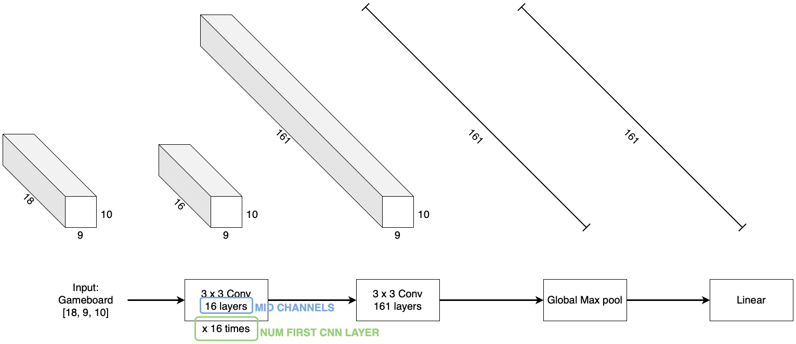

# Explanation of the configurable arguments

### Model configs
- `PI`: Size of each layer of the Linear layer used for the Actor Model
- `VF`: Size of each layer of the Linear layer used for the Critic Model
- `MID_CHANNELS`: Number of channels of the CNN (see example below)
- `NUM_FIRST_CNN_LAYERS`: Number of passes through the CNN (see example below)
- `SHARE_FEATURES_EXTRACTOR`: Whether sharing the feature extraction between Actor and Critic
- `CHECKPOINTS`: Load the old checkpoint to continue the training process if the `relative_path` to the old checkpoint is received.

### Training configs
- `LR`: Learning rate
- `N_STEPS`: Rollout Length
- `BATCH_SIZE`: Batch size for each training process
- `ENTROPY_COEFF`: Entropy coefficient (Used in `loss` computing process)
- `VF_COEF`: Value coefficient (Used in `loss` computing process)

### Reward configs
- `GAMMA`: How important the points you get later are compared to the points you get right now.

    _Deeper config in computation of `reward` is located in [RolloutBuffer.compute_rewards](../training/common/buffers.py)_

### Logging configs
- `DEVICE`: `"cuda"` if using GPU else `"cpu"`
- `PREFIX_NAME`: Used in name for model

---
# Giải thích về các tham số cấu hình

### Cấu hình Mô hình
- `PI`: Kích thước của mỗi lớp trong mô hình Linear được sử dụng cho Actor
- `VF`: Kích thước của mỗi lớp trong mô hình Linear được sử dụng cho Critic
- `MID_CHANNELS`: Số kênh của CNN (xem ví dụ bên dưới)
- `NUM_FIRST_CNN_LAYERS`: Số lần thông qua CNN (xem ví dụ bên dưới)
- `SHARE_FEATURES_EXTRACTOR`: Có chia sẻ phần trích xuất đặc trưng giữa Actor và Critic hay không
- `CHECKPOINTS`: Tải Checkpoint cũ để tiếp tục quá trình huấn luyện nếu được nhận `relative_path`.

### Cấu hình Huấn luyện
- `LR`: Learning Rate
- `N_STEPS`: Độ dài Rollout
- `BATCH_SIZE`: Kích thước batch cho mỗi quá trình huấn luyện
- `ENTROPY_COEFF`: Hệ số loss entropy (Sử dụng trong quá trình tính toán loss)
- `VF_COEF`: Hệ số loss của Value Function (Sử dụng trong quá trình tính toán loss)

### Cấu hình Phần thưởng
- `GAMMA`: Tầm quan trọng của phần thưởng bạn nhận được khi tích lũy so với phần thưởng tức thời.

    Tùy chỉnh sâu hơn với `reward` có thể vào [RolloutBuffer.compute_rewards](../training/common/buffers.py)_

### Cấu hình Ghi log
- `DEVICE`: "cuda" nếu sử dụng GPU, ngược lại là "cpu"
- `PREFIX_NAME`: Sử dụng trong tên cho mô hình

### Hiệu ứng của các Tham số Cấu hình

| Tham số              | Tăng                               | Giảm                              |
|----------------------|------------------------------------|-----------------------------------|
| `PI`                 | Tăng độ phức tạp của Mô hình Diễn viên, có thể cải thiện hiệu suất nhưng cũng tăng thời gian huấn luyện và yêu cầu tài nguyên. | Giảm độ phức tạp của Mô hình Diễn viên, giảm thời gian huấn luyện nhưng có thể làm giảm hiệu suất. |
| `VF`                 | Tăng độ phức tạp của Mô hình Phê bình, có thể cải thiện hiệu suất nhưng cũng tăng thời gian huấn luyện và yêu cầu tài nguyên. | Giảm độ phức tạp của Mô hình Phê bình, giảm thời gian huấn luyện nhưng có thể làm giảm hiệu suất. |
| `MID_CHANNELS`       | Tăng số lượng kênh của CNN, cải thiện khả năng trích xuất đặc trưng nhưng tăng yêu cầu tính toán và bộ nhớ. | Giảm số lượng kênh của CNN, giảm yêu cầu tính toán và bộ nhớ nhưng có thể giảm khả năng trích xuất đặc trưng. |
| `NUM_FIRST_CNN_LAYERS` | Tăng số lượng lớp CNN, cải thiện khả năng trích xuất đặc trưng nhưng tăng yêu cầu tính toán và bộ nhớ. | Giảm số lượng lớp CNN, giảm yêu cầu tính toán và bộ nhớ nhưng có thể giảm khả năng trích xuất đặc trưng. |
| `SHARE_FEATURES_EXTRACTOR` | Chia sẻ tính năng giữa Diễn viên và Phê bình, giảm yêu cầu tài nguyên nhưng có thể làm giảm hiệu suất riêng lẻ của từng mô hình. | Không chia sẻ tính năng, cải thiện hiệu suất riêng lẻ của từng mô hình nhưng tăng yêu cầu tài nguyên. |
| `LR`                 | Tăng tốc độ học, mô hình học nhanh hơn nhưng có thể không ổn định. | Giảm tốc độ học, mô hình học ổn định hơn nhưng chậm hơn. |
| `N_STEPS`            | Tăng độ dài Rollout, cải thiện chất lượng cập nhật nhưng tăng yêu cầu bộ nhớ. | Giảm độ dài Rollout, giảm yêu cầu bộ nhớ nhưng có thể làm giảm chất lượng cập nhật. |
| `BATCH_SIZE`         | Tăng kích thước batch, cải thiện ổn định huấn luyện nhưng tăng yêu cầu bộ nhớ. | Giảm kích thước batch, giảm yêu cầu bộ nhớ nhưng có thể làm huấn luyện kém ổn định. |
| `ENTROPY_COEFF`      | Tăng hệ số entropy, khuyến khích mô hình khám phá nhiều hơn nhưng có thể làm giảm hiệu suất tức thời. | Giảm hệ số entropy, mô hình ổn định hơn nhưng có thể giảm khả năng khám phá. |
| `VF_COEF`            | Tăng hệ số giá trị, mô hình chú trọng nhiều hơn vào giá trị nhưng có thể giảm khả năng tối ưu hóa phần khác của `loss`. | Giảm hệ số giá trị, mô hình chú trọng nhiều hơn vào các phần khác của `loss` nhưng có thể giảm hiệu suất Value. |
| `GAMMA`              | Tăng gamma, mô hình chú trọng nhiều hơn vào phần thưởng tương lai. | Giảm gamma, mô hình chú trọng nhiều hơn vào phần thưởng hiện tại. |

